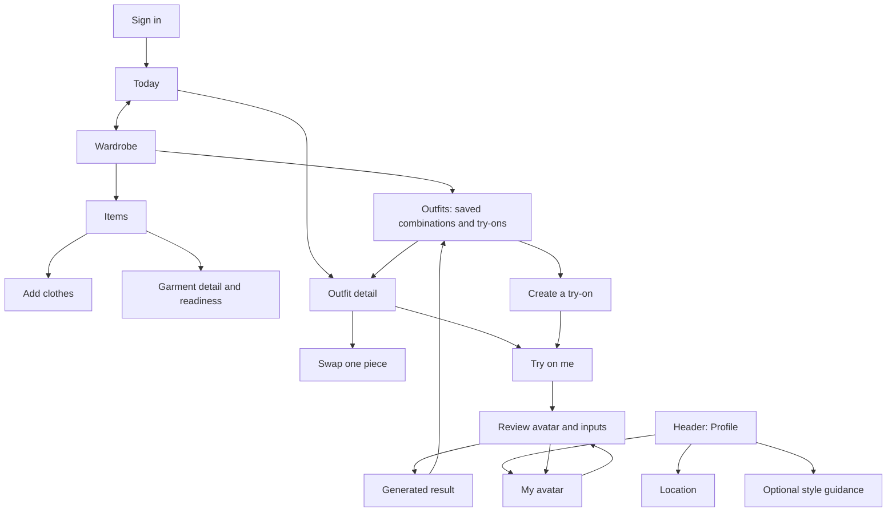

# Wardrub: current user flows → proposed experience

Recorded 13 September 2026. This is the migration inventory, not a claim that the redesign has shipped.

The central change is to organize Wardrub around choosing and managing clothes each day. Today answers “What should I wear?” Wardrobe answers “What do I own, where is it, and is it ready?” Avatar creation and virtual try-on remain complete, accessible flows.

## 1. What “current” means

This audit reads the actual route definitions, page handlers, shared state and relevant API/storage calls. It covers all eight routed screens, their reachable dialogs, and the recovery paths visible in the inspected application. It is a code audit; it does not establish that every path works against production services.

| Baseline | Meaning |
|---|---|
| Main snapshot `d754dda` | Existing application before our recommender work. The old feed requires ten garments and uses magazine generation. This is a repository snapshot, not a fresh verification of the live deployment. |
| Local implementation `40961a8` on `codex/recommender-foundation` | Current comparison baseline below. Includes foundation commit `c8e765b`: grounded recommendations, stable outfit IDs, constrained swaps, truthful weather and per-item readiness. These changes have not been pushed or deployed. |
| Proposed Release A | Minimalist Today/Wardrobe design plus the durable outfit and closet-management behavior described below. Most visual changes and several persistence contracts remain to be built. |
| Proposed Release B | Shopping assessment after the daily wardrobe loop is validated. Social imports remain deferred. |

Prior foundation verification recorded 72 backend tests, 62 frontend tests and 12 browser cases passing. Browser cases used API fixtures; this document adds no claim of live generation, live weather or production data verification. The audit itself changes documentation only.

## 2. Navigation and screen coverage

Current mobile navigation is **Wardrobe · Feed · Try On · Looks · Profile**. Desktop has **Feed · Wardrobe · Try On · Looks**, with Profile separately at the bottom. Both represent the same five destinations, in a different order.

Proposed Release A uses **Today · Wardrobe**, with Profile in the header. Wardrobe has **Items · Outfits**. Outfits exposes saved combinations and generated try-ons through clearly labeled views, plus **Create a try-on**. Release B adds Shop only when a purchase assessment can be completed.

| Current route/screen | Proposed home | What changes |
|---|---|---|
| `/login` — Login | Sign in | Keep Google authentication and initialization/retry states. Resume a valid internal destination after authentication instead of always returning to `/`. |
| `/` — MagazineFeed | Today | Replace The Looker masthead and magazine hierarchy with one outfit, useful context, a primary daily action and a small set of alternatives. |
| `/daily-outfit` — also MagazineFeed | Today alias | Preserve the bookmark. `DailyOutfit.jsx` is not the component currently mounted at this route. |
| `/wardrobe` — Home | Wardrobe → Items | Keep search, sort and categories. Add readiness to garment browsing and detail, then optional location and batch actions. |
| `/capture` — Capture | Add clothes, entered from Today or Wardrobe | Keep camera and gallery. Use one coherent add/review/result flow, preserve successful uploads and return to the originating task. |
| `/dressing-room` — DressingRoom | Wardrobe → Outfits → Create a try-on | Keep manual outfit selection and generation. Remove its separate main-navigation destination only after the new entry is available. |
| `/create-avatar` — CreateAvatar | Profile → My avatar; contextual detour from Try on me | Keep both photo paths; add candidate review, safe activation and return to the selected outfit. |
| `/looks` — SavedLooks | Wardrobe → Outfits → Try-ons | Preserve generated history and actions. Add separately persisted saved combinations, without mislabeling old images as wearable outfit records. |
| `/profile` — Profile | Header → Profile | Separate My avatar, location, optional style guidance and account/support utilities into clear entries. |

Additional current surfaces accounted for: setup widget; gallery queue; camera overlay; garment front/back preview and delete confirmation; feed outfit detail; clothing-readiness expander; manual try-on result; look preview and delete confirmation; look options/occasion selector; location picker; style-analysis progress/retry; legacy-data recovery banner; loading and error states.

### Proposed navigation map

The diagram is proposed behavior. In particular, return-to-outfit and the saved-combination store do not exist yet.

## 3. Complete flow register

**Keep** means retain existing behavior while simplifying its presentation. **Change** means an existing journey needs behavioral work. **New** means the current UI cannot complete that journey. All proposed behavior below is pending unless explicitly described as part of the local foundation.

### Entry and setup

| ID / intent | Current screens and behavior | Proposed screens and behavior | Work |
|---|---|---|---|
| F01 — Sign in or recover authentication | Protected route → Login → Google sign-in → Feed. Initialization errors offer retry; sign-in errors can be dismissed. Login always navigates to `/`; requested destination is not retained. Development bypass is configuration-dependent, not a production onboarding step. | Login → original valid internal destination, or Today. Preserve recoverable auth states and clear private state on account changes. | Change: destination restoration. |
| F02 — Start with an empty closet | Feed empty state → Capture. Floating setup widget presents avatar, clothes and analysis milestones. Locally, clothes readiness means a top + bottom or a dress; avatar and analysis are optional for recommendations, but the widget still treats all three as overall completion. Main snapshot still has the ten-item feed gate. | Today → “Add an outfit you own” → Add clothes → usable result → first suggestion. Optional avatar/analysis prompts appear when relevant, without leaving the core setup looking unfinished. A viable category set is not proof that its items are ready to wear. | Change: progressive setup and success destination; preserve foundation eligibility. |
| F03 — Move between features | Five destinations; Add appears in the wardrobe toolbar and grid. Profile-avatar buttons on Wardrobe/Looks send users without an avatar to creation. Setup widget can be minimized and links to unfinished tasks. | Two consistent destinations on mobile/desktop; one obvious Add action; header Profile always opens Profile. Contextual onboarding replaces the persistent completion checklist on the daily path. | Change: shared shell and entry points. |

### Add clothes

| ID / intent | Current screens and behavior | Proposed screens and behavior | Work |
|---|---|---|---|
| F04 — Import existing photos | Capture → Upload from gallery → select up to five photos, 10 MB each → preview/remove → Detect & Add → sequential per-photo results. Detected garments are added automatically. The queue remains on the page; there is no detected-item confirmation screen or dedicated “See outfits” result step. | Add clothes → gallery → compact queue → additions/review → Add more or See my outfit. Keep current limits and partial successes. A pre-save review/duplicate correction flow needs an ingestion contract; moving existing cards alone cannot provide it. Expanded photo-import experiments remain deferred. | Keep batch processing; change completion flow. Detection review is separate behavioral work. |
| F05 — Photograph one garment | Capture → Take photo → choose Top/Bottom/Dress/Outer → front image → preview/retake → optional back image → ghost-mannequin toggle → confirm → Feed. Webcam failure falls back to file input. | Add clothes → Camera → front review → confirm category → Add. Put back photo and image-cleanup options under secondary controls. Return to Wardrobe or first-outfit progress according to origin. Keep retake and gallery fallback. | Change: shorter default path and return context; reuse processing. |
| F06 — Recover from capture failure | Gallery shows per-photo pending/processing/success/failure, with explicit retry. Leaving stops unscheduled photos after the current request; it does not cancel a server write. A lost response can follow a successful save. Single capture keeps selected files after failure. | Keep successes visible and useful. Retry a failed photo deliberately; reconcile uncertain saves before resubmitting. Returning after navigation must explain what is known. Do not promise resumable background batches without durable jobs. | Keep recovery; improve status and reconciliation. |

### Browse and manage clothes

| ID / intent | Current screens and behavior | Proposed screens and behavior | Work |
|---|---|---|---|
| F07 — Find a garment | Wardrobe → search descriptions/categories; All/Tops/Bottoms/Dresses/Outerwear filters; Recent/Name/Category sort → grid. Empty and no-match states differ. There is no Shoes chip even though the local ranker supports indexed shoes. | Wardrobe → Items → search and relevant category/readiness filters → garment. Retain useful controls, reduce card framing and duplicate Add controls. Category presentation must reflect what ingestion actually supports. | Mostly presentation; readiness filtering is behavior. |
| F08 — Inspect a garment | Grid → preview → front/back when available → close. Detail is primarily image/category plus removal. No reachable edit-name/category/location or outfit-combinations action. | Garment detail → images, identity, readiness and optional location; “Use in an outfit” and secondary edit actions when supported. Missing images preserve the record and offer recovery. | Change/new detail contracts. |
| F09 — Remove a garment | Grid menu or preview → confirm Delete/Remove → backend deletion → updated wardrobe; cancellation is supported. This is removal, not a lend/retire flow. | Detail/menu → clear delete confirmation → confirmed removal. Keep independent generated history; saved outfits with missing pieces must identify them and offer a replacement. If archive/retire is introduced later, give it a separate meaning. | Keep deletion; add saved-outfit invalidation/recovery. |

### Choose, adjust and maintain an outfit

| ID / intent | Current screens and behavior | Proposed screens and behavior | Work |
|---|---|---|---|
| F10 — Choose today's outfit | Feed → cover collage or generated preview → outfit detail; alternatives below. Magazine masthead, refresh-issue language and generation actions remain. The local service returns one cover plus up to three alternatives; legacy one-item-three-ways/underused presentation remains in code but is not populated by this policy. Weather unknown/no-location and no-viable-outfit states are explicit locally. | Today → one recommended outfit with concise weather/context and garment readiness → Plan for today; Swap stays visible, alternatives follow. Expand reasons and secondary actions on demand. Keep truthful missing context and freshness; no generated image needed to get dressed. | Presentation plus durable daily intent. |
| F11 — Change one piece | Locally: cover swap suggestion or detail → Swap category → server validates and replaces one piece → updated outfit; others stay fixed. No alternative leaves outfit unchanged. Errors/conflicts are surfaced. | Today/outfit → choose piece → view eligible alternatives → select → return to updated outfit, retaining other choices. “In laundry” is an availability correction, not a dislike. | Keep swap engine; change choice UI and cancellation/return behavior. |
| F12 — Explain a preference | Feed/detail Love → generic feedback record. There is no reachable reason selector or preference editor; the local ranker does not learn from these events yet. | Optional “Why change it?” → availability, temporary context or enduring preference. Make lasting preferences editable. Use separate decision/exposure/action records before claiming the assistant learns taste. | New feedback semantics and modest personalization. |
| F13 — Save a combination | Feed/detail Save → feedback endpoint → “Feedback recorded.” It does not create an outfit retrievable in Looks. In LookPreview, the separate button labeled Save downloads an image. | Outfit → Save outfit → confirmation → Wardrobe → Outfits → Saved outfits → reopen after reload. Rename image export Download. Generation remains independent. | New persistence; required before exposing a working Saved outfits view. |
| F14 — Plan and confirm wear | No reachable plan, wear-confirmation or wear-history UI. A `wore_this` branch in the feedback handler does not constitute a complete user flow. | Outfit → Plan for today → selected outfit on Today → I wore this → confirmation and Undo. Save, planned and worn are distinct; wear does not automatically put every garment in laundry. | New daily intent, wear records and reversible actions. |
| F15 — Mark readiness | Local foundation: Feed → Clothing readiness expander → find garment → Unknown/Ready/In laundry → server confirmation → recomputed outfits. Undo last change uses the confirmed version; it is component state, not a durable history screen. | Wardrobe → Items/detail → readiness; also available when a suggested item is unavailable. Show explicit Unknown versus Ready. Keep conflict handling and undo while moving bulk management off Today. | Keep foundation API; change placement/presentation. |
| F16 — Laundry return and finding clothes | One garment at a time through F15. No batch laundry list, return-batch record, shelf/location editor or physical-location lookup. | Items → select pieces → Send to laundry → laundry view → select returned pieces → Mark ready → Undo. Optional location labels appear on garment/outfit detail so the user can find pieces. Unknown stays unknown; tracking requires confirmation. | New batch and location behavior. No autonomous tracking promise. |

### Avatar and virtual try-on

| ID / intent | Current screens and behavior | Proposed screens and behavior | Work |
|---|---|---|---|
| F17 — Create avatar from full-body photo | CreateAvatar → upload one full-body image → input preview/remove → Create → processing → active avatar saved → Feed. Input remains selected on failure. | My avatar or contextual setup → full-body input → review → generate candidate → Use this avatar → return to origin. Keep the existing source path and processing capability. | Change: output review, activation and origin. |
| F18 — Create avatar from selfie | CreateAvatar → selfie webcam → capture (or file fallback) → preview/remove → Create → selfie applied to default body → active avatar → Feed. | Same separate selfie option with honest preview expectations → review generated candidate → accept → origin. Preserve camera permission/fallback and retry. | Change lifecycle; keep selfie capability. |
| F19 — Update existing avatar | Profile avatar → CreateAvatar → replace through the same creation flow. Successful generation activates directly; no reject-candidate stage or version gallery exists. | My avatar → current image → new input → candidate → Use this avatar / Keep current. Activate only after acceptance; preserve active avatar on failure/rejection. Old generated images remain unchanged. | New candidate/activation contract. Full avatar-version gallery deferred. |
| F20 — Try suggested outfit without an avatar | Feed → Run Try-on → CreateAvatar → create → Feed. Outfit/detour context is not carried. The user must find the outfit again; manual dressing room instead blocks on a no-avatar screen. | Outfit → Try on me → Create avatar → accept → exact original outfit/input review → Generate. Cancel returns to that same outfit. Revalidate garment availability without silently discarding selections. | Change: durable/contextual return state. |
| F21 — Build a try-on manually | Try On → Dressing Room → current avatar + garment carousels → select one per category → Try On → result. Dress excludes top/bottom; outerwear works with either. The button permits any nonempty selection, including a single item. No avatar/empty closet have setup actions. | Wardrobe → Outfits → Create a try-on → select supported pieces → review avatar/inputs → Generate. Keep single-item preview as well as compatible multi-item selection; an incomplete preview need not count as a complete daily outfit. | Keep capability; simplify selection and relocate entry. |
| F22 — Generate, inspect, retry | Feed generates inline and opens detail; its failure handler mainly logs errors. Dressing Room uses shared loading/error state and a result modal with Download, Share and Try Another Look. New generated results are stored server-side; feed generation bypasses the shared Looks cache update. Local feed explicitly omits shoes from rendering while keeping them in the outfit. | Shared input review → meaningful processing → result with history location, Download/Share and another preview. On failure show Retry and keep the outfit usable. Refresh history on success; show supported rendering categories. Do not label generation as wear, ownership or fit validation. | Change: unified lifecycle, visible failure and history freshness. |

### Find and manage creations

| ID / intent | Current screens and behavior | Proposed screens and behavior | Work |
|---|---|---|---|
| F23 — Reopen generated looks | Looks → All/Favorites and newest/oldest → image/date → preview. Empty history links to Dressing Room. The history API currently lists up to 50 results. This is generated-image history, not all saved clothing combinations. | Wardrobe → Outfits → All / Saved outfits / Try-ons, with favorites available → open image or combination. Preserve legacy images even without garment references. Add pagination before promising access to every historical result. | Keep history; add unified views and pagination where needed. |
| F24 — Favorite, label, export or delete a look | Look menu → favorite toggle, occasion (Everyday/Work/Weekend/Evening/Event), Share or Delete confirmation. Preview → Save (download), Share or Delete confirmation. Sharing uses native share/clipboard where available. | Retain favorite, occasion/date, Download, Share and explicit delete. Separate delete-preview from delete-combination; neither silently deletes clothes/avatar. Multiple previews can belong to one combination. Surface action failures and preserve context. | Keep actions; clarify labels and object relationships. |

### Profile and account

| ID / intent | Current screens and behavior | Proposed screens and behavior | Work |
|---|---|---|---|
| F25 — Analyze colors/fit | Profile or widget → analysis focus (auto/color/fit) → select up to four supported photos → Analyze → independent progress/results or retry. Selected files survive failure; successful results remain available. Profile displays season/body guidance, color recommendations and category links. This endpoint retains results, not the uploaded analysis photos. | Profile → optional Style guidance → choose focus and photos → progress/results. Keep partial success, independent retries and appropriate photo-use text. Make guidance optional/advisory; daily suggestions do not require it. Preserve uploaded-photo versus avatar-source distinctions. | Mostly information hierarchy; editable preference corrections are separate. |
| F26 — Set location for weather | Profile → Update Location → listed city or Use current location → permission/save → updated profile. Permission/fetch/save errors are shown. This is a saved location, not continuous location tracking. | Today weather context → Set/change location, or Profile → Location → same supported choices. Show saved place and unknown weather honestly; refresh suggestions after a successful change. | Change: contextual access; reuse location service. |
| F27 — Recover previous-session data | Profile conditionally checks for legacy data → recovery banner → migrate → success/error. | Profile → conditional recovery/support entry, shown only when relevant. Preserve explicit action and data ownership; do not run migration because a user opened the redesigned screen. | Keep utility, reduce its prominence. |
| F28 — Sign out / switch account | Profile → Sign out → Login. Shared private wardrobe/profile state is keyed to user and resets on account changes. | Profile → Account → Sign out. Clear any new outfit drafts, preferences and cached history at the same account boundary. | Keep; extend isolation to new state. |

### Later product flows, with no current complete UI

| ID / intent | Current boundary | Proposed behavior | Work |
|---|---|---|---|
| F29 — Assess a purchase | No Shop route or completed shopping flow. Product-matching services and an extension bootstrap endpoint are supporting infrastructure; there is no extension client in this snapshot. | Release B: Shop → link/screenshot → confirm candidate/variant/source → compare with owned pieces and usable combinations → Keep what I own / Save for later / merchant handoff. Unknown facts stay unknown; candidate stays separate from owned inventory. | New product milestone, not part of decluttering existing screens. |
| F30 — Import from social | No connected-social closet ingestion flow. | Deferred by founder decision. Existing selected-photo capture remains available. Any later import must confirm person, garment identity and current ownership; an old photo cannot establish readiness. | Deferred; not a Release A dependency. |

## 4. Five before/after walkthroughs with screens

These sequences describe behavior, not measured click counts. Required steps differ with the user's existing wardrobe and avatar.

### A. First useful outfit

**Current local:** Login → Feed/no outfit + setup widget → Capture/method choice → Gallery queue or camera preview → clothes saved → return/navigate to Feed → suggestion. Gallery and camera have different completion experiences.

**Proposed:** Login → Today/start with an outfit → Add clothes → additions/result → Today/first suggestion. Add more is available; avatar and analysis wait until requested. If there is no viable outfit, explain the missing role or unavailability rather than making the user complete a broad checklist.

### B. Get dressed in the morning

**Current local:** Feed/cover → outfit detail → possibly Swap → Love or Save feedback. The product does not complete a find/plan/wear loop.

**Proposed:** Today/outfit → optional Swap → Plan for today → selected outfit with item readiness/location → grab clothes → I wore this → confirmation/Undo. If an item is unavailable, correct readiness and replace it; do not silently mark it worn.

### C. Clothes return from washing

**Current local:** Feed → readiness expander → search garment → Ready; repeat per piece.

**Proposed:** Wardrobe/Items → In laundry → select returned items → Mark ready → confirmation/Undo → Today can use them again. Only confirmed returned pieces change state. Location can be set once for the selected returned items if the user chooses.

### D. Preview an outfit on yourself

**Current:** Feed/outfit → Run Try-on → if no avatar, CreateAvatar → generate → Feed, losing the detour. With avatar, generate inline; manual Try On has a different result surface.

**Proposed:** Outfit → Try on me → review current avatar and clothes → Generate → result → Wardrobe/Outfits/Try-ons. Without avatar: create/review/use → return to the same input review. Failure keeps the outfit and offers retry. Manual Create a try-on joins this same result flow.

### E. Reuse an outfit next week

**Current:** Feed Save records feedback; only a generated look can later be found in Looks. Opening an image does not reliably reconstruct its clothes.

**Proposed:** Outfit → Save outfit → Wardrobe/Outfits/Saved outfits → reopen → recheck current readiness → plan, swap or optionally try on. A saved outfit remains accessible without an image. A legacy image remains accessible without pretending its garment IDs are known.

## 5. What the new screens show by default

| New screen | Visible first | Secondary / on demand | Removed from this surface |
|---|---|---|---|
| Today | One outfit, short context, readiness caveat, Plan for today, Swap | Alternatives, explanation, Save outfit, Try on me, contextual correction | Oversized magazine masthead, editorial sections, full closet readiness list, general setup checklist |
| Wardrobe → Items | Search, useful filters, garment grid, one Add action | Sort, multi-select/laundry, garment detail and delete | Duplicate Add tile plus toolbar action; repeated decorative containers |
| Garment detail | Photo/name/category, readiness, known location | Front/back, edit/correct, use in outfit, delete | Multiple equivalent view toggles; destructive action as the dominant purpose |
| Wardrobe → Outfits | Saved combinations and try-ons clearly labeled; Create a try-on | Favorites, occasion, sort, preview detail and export | Separate competing Looks/Try On main tabs |
| Add clothes | Camera/gallery choice, compact queue or image review | Back photo, cleanup option, per-photo retry | Technical image-processing choices competing with Add |
| Avatar/input review | Current avatar or clear creation choices; selected clothes | Replace input, supported preview details | Unconditional return Home; replacing active avatar without reviewing candidate |
| Generated result | Image, saved-history confirmation, Done | Download, Share, another preview, metadata | Ambiguous Save wording; no-result failures without a visible explanation |
| Profile | My avatar, location, optional style guidance, account | Analysis detail, recovery utility | Full analysis dashboard as the default account screen |

“Removed from this surface” does not mean deleting the underlying capability or user data. Features move only when their replacement entry and return path work. Shop remains out of the Release A navigation.

## 6. Behavior contracts the redesign must settle

1. **Save outfit** persists garment references and enough information to reopen the combination. A stable ranker ID alone is insufficient. Verify success after reload and across sessions.
2. **Plan for today** stores intent for a date; **I wore this** confirms an event. Neither is inferred from a generated image, a view or a save. Define the user's day explicitly while preserving the existing UTC feed-date contract during compatibility.
3. **Readiness** is a confirmed clothing fact, separate from ownership and preference. Undo must respect newer changes; batch operations need defined partial-failure/retry behavior.
4. **Find clothes** uses optional user-provided locations, not inferred physical tracking. Unknown location is a legitimate state.
5. **Try-on identity** retains the outfit/input snapshot and avatar reference/revision. Current feed try-on requests omit garment IDs, so legacy outputs cannot be assumed reconstructible. Cached responses also need a reliable history/result identity.
6. **Avatar replacement** requires a candidate and explicit activation. Keeping the existing avatar until acceptance cannot be achieved with a cosmetic confirmation after it has already been overwritten.
7. **Deletion** targets the selected object: garment, combination or generated preview. Keep historical images accessible and flag unavailable/missing garment references.
8. **Preference corrections** distinguish temporary context, availability and lasting taste. Feedback collection is not evidence of learning; evaluate changes against the fixed recommender baseline.
9. **Navigation and errors** preserve origin and selection on cancel/retry. Do not promise resumable generation or uploads without supporting jobs and storage.

## 7. Implementation order and parity checks

| Slice | Flow IDs | Acceptance before replacing the old entry |
|---|---|---|
| A — Shared visual system + Wardrobe Items | F03, F07–F09, F15 | Search/sort/category, add, front/back, confirmed delete and readiness work at mobile/desktop widths; retain error and empty states. |
| B — Saved combinations + Outfits | F13, F23–F24 | Save without generation survives reload; old try-ons/favorites/occasion/export/delete survive; missing garment references are explicit. |
| C — Today + daily intent + corrections | F10–F14, F26 | One useful suggestion, preserved swaps/weather/freshness, real plan/wear/undo and clearly scoped feedback. |
| D — Add clothes + contextual setup | F01–F06 | Small viable wardrobe gets a suggestion; camera/gallery partial successes survive; optional setup no longer competes with first usefulness. |
| E — Avatar/try-on parity | F17–F22 | Both avatar input paths; candidate activation; original outfit restored after create/cancel; manual and suggested generation; visible retry; history freshness. This is required for Release A, not optional cleanup. |
| F — Closet upkeep + profile + integrated QA | F16, F25, F27–F28 plus all above | Confirmed laundry batches/returns and undo; optional locations; analysis recovery; legacy data and account isolation; old links usable. |
| Later — Shop | F29 | Candidate/owned distinction and a complete purchase-assessment loop before adding Shop navigation. F30 remains deferred. |

Do not swap the navigation first and leave users searching for their creations. Ship bounded slices with compatible old routes; simplify the shell once the relocated flows work. Prior recommender tests remain required when their behavior changes. Add behavior-focused coverage for new persistence and recovery, rather than tests that merely freeze styling.

Visual/runtime checks still required during implementation: actual signed-in production/test-account screen audit, real garment imagery, camera permission denial, partial saves, offline/expired auth, missing images, long text, keyboard/focus, screen-reader status, narrow and wide layouts, and suitable real generation fixtures. No new production operations or asset migration were performed for this audit.

## 8. Source map and exclusions

Source paths are relative to the repository at `40961a8`; line numbers identify inspected entry points and may move in later commits.

| Evidence | Source |
|---|---|
| All active routes and protected layout | `frontend/src/App.jsx:35`, `frontend/src/App.jsx:73` |
| Mobile/desktop destinations | `frontend/src/components/BottomNav.jsx:4`, `frontend/src/components/SideNav.jsx:6` |
| Login, sign-out and account isolation | `frontend/src/pages/Login.jsx:23`, `frontend/src/context/AuthContext.jsx:146`, `frontend/src/context/WardrobeContext.jsx:17` |
| Setup milestones and overall completion | `frontend/src/context/OnboardingContext.jsx:37`, `frontend/src/context/OnboardingContext.jsx:45` |
| Wardrobe search/sort/detail/delete | `frontend/src/pages/Home.jsx:59`, `frontend/src/pages/Home.jsx:86`, `frontend/src/components/GarmentPreview.jsx:15` |
| Camera process and unconditional home return | `frontend/src/pages/Capture.jsx:175`, `frontend/src/pages/Capture.jsx:219` |
| Gallery limits, queue and retry behavior | `frontend/src/components/GalleryUpload.jsx:6`, `frontend/src/components/GalleryUpload.jsx:56` |
| Feed save/feedback, swap, try-on and missing avatar | `frontend/src/pages/MagazineFeed.jsx:151`, `frontend/src/pages/MagazineFeed.jsx:177`, `frontend/src/pages/MagazineFeed.jsx:207` |
| Per-item readiness and versioned undo | `frontend/src/components/ClosetReadiness.jsx:33`, `backend/app/routers/outfit.py:551` |
| Feedback is a separate record | `backend/app/routers/outfit.py:575` |
| Avatar input modes and return | `frontend/src/pages/CreateAvatar.jsx:14`, `frontend/src/pages/CreateAvatar.jsx:108`, `backend/app/routers/avatar.py:28` |
| Manual selection and result actions | `frontend/src/pages/DressingRoom.jsx` |
| Generation and history persistence, 50-result read limit | `backend/app/routers/tryon.py:187`, `backend/app/routers/tryon.py:215` |
| Shared try-on updates versus direct feed request | `frontend/src/context/WardrobeContext.jsx:350`, `frontend/src/pages/MagazineFeed.jsx:232` |
| History filters, metadata and export | `frontend/src/pages/SavedLooks.jsx:61`, `frontend/src/pages/SavedLooks.jsx:90`, `frontend/src/components/LookPreview.jsx:22` |
| Location, analysis, legacy recovery, avatar update | `frontend/src/pages/Profile.jsx:185`, `frontend/src/pages/Profile.jsx:202`, `frontend/src/pages/Profile.jsx:260`, `frontend/src/pages/Profile.jsx:380` |
| Existing local foundation and verification limits | `docs/progress/recommender-PROGRESS.md`, `backend/app/services/closet_ranker.py`, `backend/app/services/magazine_feed_service.py` |
| Extension boundary | `backend/app/routers/extension.py:35`, `docs/progress/chrome-extension-PROGRESS.md` |

The proposed design follows the task's `wardrub-design-migration-plan.md` deliverable and the founder's priority: capture → choose → find → wear → laundry → ready again, preserving avatars and creations. This register makes the screen-level differences and unimplemented contracts explicit.

Excluded from the current user-flow count: the unmounted `DailyOutfit.jsx` page; unreferenced legacy components such as `TryOnScreen`, `AvatarPreview`, `QualityFeedback`, `WardrobeGrid` and the standalone Camera component; backend-only recommendation/forecast/scheduler/product utilities; unfinished extension endpoints and plans. For example, an avatar-delete API exists, but no active routed screen exposes it. These are not evidence of a working user-facing journey.
